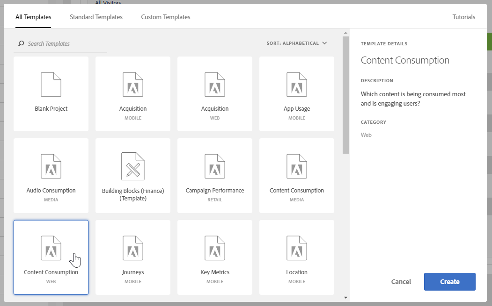

# Creare un rapporto di base in Analysis Workspace per gli utenti di Google Analytics

Analysis Workspace (una delle funzionalità principali di Adobe Analytics) fornisce un'area solida che consente a un utente di ottenere informazioni sui dati raccolti. I rapporti sono molto diversi tra Google Analytics e Adobe Analytics:

* La struttura di reporting in Google Analytics consente di selezionare un particolare tipo di dati, ad esempio geolocalità o traffico. La piattaforma utilizza una visualizzazione di reporting preconfigurata in base al modo migliore per visualizzare tali dati.
* La struttura di reporting in Analysis Workspace fornisce un canvas vuoto, fornendo maggiore flessibilità nelle esigenze di reporting e segnalazione.

Poiché Analysis Workspace funziona più come un quadro rispetto ai report preconfigurati, la creazione di rapporti da Google Analytics è semplicemente una questione di utilizzo delle visualizzazioni e dei componenti corretti.

## Termini chiave utilizzati in Workspace

* **I pannelli** sono i blocchi di lavoro che consentono di ignorare l'area di lavoro. In quasi tutti gli scenari viene utilizzato un pannello Freeform.
* **Le visualizzazioni** costituiscono tutti i pannelli a forma libera. Lo scopo è quello di rappresentare i dati in diversi formati. La maggior parte del tempo è una tabella, ma altre volte può essere un grafico a linee o a linee. Molti report in Google Analytics sono composti dell'equivalente di due visualizzazioni: un grafico a linee e una tabella a forma libera.
* **I componenti** vengono inseriti in una visualizzazione per restituire dati. I componenti possono essere combinati in diversi modi per soddisfare le esigenze di reporting.
   * **Le dimensioni** sono valori variabili e contengono in genere testo. Esempi: nome della pagina, referente o paese geografica. Sono più comunemente elencate come righe in una tabella.
   * **In** genere, le metriche indicano un evento o una conversione di un certo ordine. Gli esempi includono eventi comuni come la visualizzazione di una pagina, o qualcosa di più significativo come un acquisto o una registrazione. Vengono comunemente visualizzate come colonne nelle tabelle per mostrare quante volte si è verificato l'evento per dimensioni.
   * **I segmenti** sono un sottoinsieme di dati e si comportano in modo simile ai segmenti in Google Analytics. Consentono di creare filtri personalizzati e di concentrarvi su una parte specifica dei dati.
   * **Gli intervalli di date** consentono di organizzare i dati in base a quando si è verificato un evento. Sono la colonna portante della visualizzazione delle tendenze nel tempo e in genere sono abbinate a una metrica.

## Creare un rapporto di base in Workspace

Create un rapporto Tutte le pagine (simile a quello in Google Analytics) trascinando i componenti corretti su un quadro area di lavoro.

1. Log in to [experiencecloud.adobe.com](https://experiencecloud.adobe.com) using your Adobe ID credentials.
2. Fai clic sull'icona 9 quadrati in alto a destra, quindi fai clic sul logo di Analytics colorato.
3. Nella barra di navigazione superiore, fate clic su Area di lavoro.
4. Fate clic sul pulsante Crea nuovo progetto.
5. Nella finestra a comparsa modale, accertatevi che «Blank Project» sia selezionato, quindi fate clic su Create (Crea).
6. A sinistra, viene visualizzato un elenco di dimensioni, metriche, segmenti e intervalli di date. Individua la dimensione Pagine (colorata arancione) e trascinala sul quadro etichettata «Rilascia una dimensione qui».
7. È possibile visualizzare un report che mostra le pagine principali di questo mese. Analysis Workspace automatically populates the report with the [Occurrences](../../../components/c-variables/c-metrics/metrics-occurrences.md) metric.
8. Una tabella in Google Analytics in genere contiene metriche 7-8. Individua la metrica Tasso di rimbalzo (colorato verde) e trascinala accanto all'intestazione della metrica Occorrenze. Se trascini la metrica Tassi rimbalzi accanto ad Occorrenze, entrambe le metriche vengono visualizzate affiancate.
9. Molte metriche possono essere affiancate trascinando metriche accanto alle intestazioni delle metriche esistenti. See [commonly used metrics](common-metrics.md) for information on how to obtain metrics typically used in Google Analytics.

   

## Iniziare con un modello di rapporto predefinito in Workspace

Crea il modello Consumo contenuto (simile al report Tutte le pagine in Google Analytics) accedendo a un modello di progetto.

1. Fate clic sul pulsante Crea nuovo progetto.
2. Individua e fai doppio clic sull'icona «Consumo contenuto (Web)» elencato in Tutti i modelli.
3. Sfoglia ciascuna visualizzazioni precedentemente creata: Flusso pagina di ingresso, Tabella pagine principali, Uscita da Flusso pagina, Flusso sezione sito di immissione e Tabella sezioni del sito principale.

   

## Provare con lo strumento

Analysis Workspace è uno strumento di reporting che non ha alcun impatto sulla raccolta dei dati. Non ci sono conseguenze per trascinare in modo indiscriminato componenti in un progetto per vedere cosa funziona. Per visualizzare le funzionalità disponibili, trascinate diverse combinazioni di dimensioni e metriche nel progetto dell'area di lavoro.

Se trascinate accidentalmente un componente non valido nel progetto dell'area di lavoro o desiderate tornare indietro di un passo, premete Ctrl + Z (Windows) o Comando + Z (Mac) per annullare l'ultima azione effettuata. You can also start with a clean slate by clicking *[!UICONTROL Project]&gt;[!UICONTROL New]* in the upper left menu.

Adobe ha inserito numerose funzionalità in Analysis Workspace nel menu di scelta rapida. La maggior parte delle visualizzazioni e dei componenti può essere premuto con il pulsante destro del mouse per un'analisi e un'interazione più dettagliate. Per visualizzare le opzioni disponibili, prendete in considerazione il fatto che fate clic con il pulsante destro del mouse sui componenti nell'area di lavoro.

## Comprendere le dimensioni e le metriche da usare

Se ti piace Analysis Workspace e desideri ricreare un report specifico in genere visualizzato in Google Analytics, individua il rapporto nella rispettiva pagina:

* [Report in tempo reale](realtime-reports.md)
* [Rapporti di audience](audience-reports.md)
* [Report di acquisizione](acquisition-reports.md)
* [Rapporti sui comportamenti](behavior-reports.md)
* [Rapporti sulle conversioni](conversions-reports.md)
