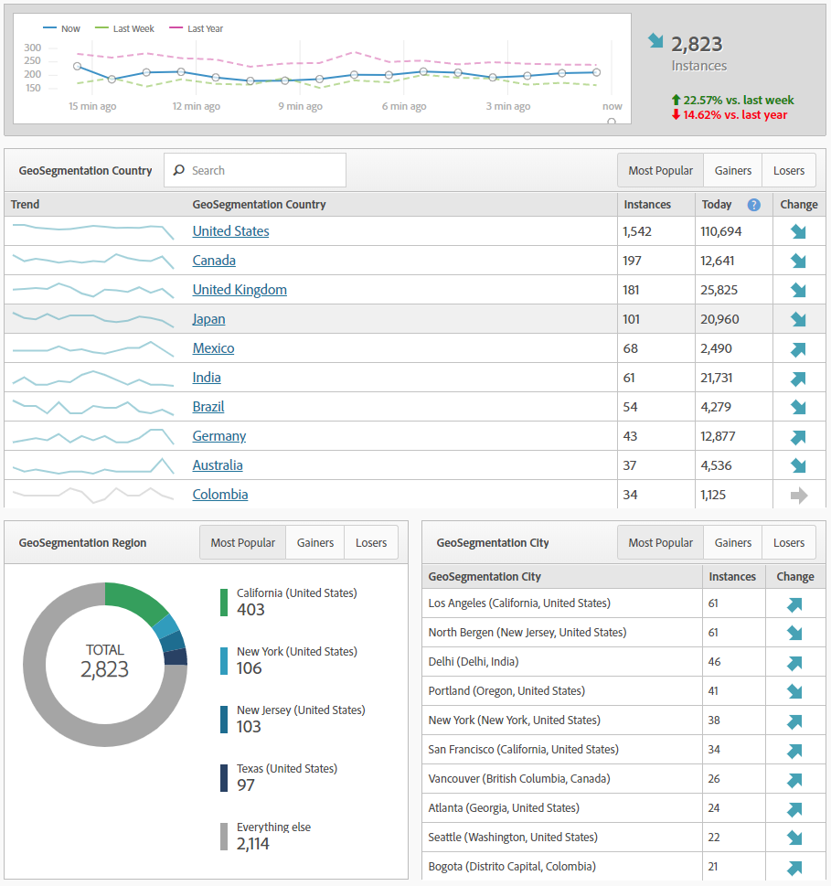
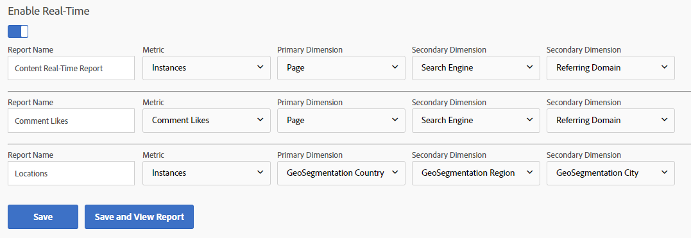

# Rapporti in tempo reale

I report in tempo reale mostrano cosa accade sul sito al momento. Questi tipi di rapporti sono particolarmente utili per vedere i risultati immediati degli aggiornamenti effettuati sul sito. Ad esempio, una società che esegue una vendita su Black Friday può misurare il traffico verso pagine specifiche e determinare quali vendite devono priorizzare in base alle prestazioni in quel momento.

I report in tempo reale sono una delle poche funzionalità che non sono ancora state introdotte in Analysis Workspace. Utilizzate Reporting e analisi per ottenere questi dati. Richiedono una configurazione semplice per iniziare a raccogliere dati.

Per raggiungere la pagina di configurazione dei report in tempo reale (autorizzazioni amministratore richieste):

1. Click [!UICONTROL Reports] in the Adobe Analytics header navigation.
2. In the left menu, Click *[!UICONTROL Site Metrics]* &gt; *[!UICONTROL Real-Time]*.
3. Se la suite di rapporti non è ancora attiva in tempo reale, viene visualizzato un messaggio con un collegamento per configurare la suite di rapporti. If the report suite has real-time enabled, click [!UICONTROL Configure] near the real-time report&#39;s title.

Adobe consente fino a tre rapporti in tempo reale per raccogliere dati simultaneamente. Devono essere configurati prima che inizino a raccogliere dati in tempo reale.

## Posizioni in tempo reale

Le posizioni in tempo reale indicano dove i visitatori risiedono mentre visita il tuo sito nel momento corrente. Per configurare uno dei tre rapporti in tempo reale per mostrare i dati sulla posizione:

1. Click [!UICONTROL Configure] near the real-time report&#39;s title.
2. Sotto uno degli slot dei report in tempo reale:
   * Denominate il rapporto in tempo reale; ad esempio, «Locations».
   * Le istanze vengono generalmente utilizzate come metrica. Al momento, gli utenti/Visitatori univoci non sono disponibili nei report in tempo reale.
   * Per Dimensione primaria, in genere viene utilizzato Paese di geosegmentazione. Sono disponibili anche Geosegmentation Region, geosegmentation US DMA e geosegmentation City.
   * Per le due dimensioni secondarie, usa i dati aggiuntivi preferiti che desideri vedere per questo traffico. Le dimensioni secondarie non devono essere specifiche per la posizione.
3. Clic [!UICONTROL Save and View Report].

## Origini traffico in tempo reale

Le origini di traffico in tempo reale indicano dove arrivano i visitatori mentre visita il tuo sito nel momento corrente. Per configurare uno dei tre rapporti in tempo reale per mostrare i dati di origini di traffico:

1. Fai clic su Configura vicino al titolo del report in tempo reale.
2. Sotto uno degli slot dei report in tempo reale:
   * Denominate il rapporto in tempo reale; ad esempio, «Origini traffico».
   * Le istanze vengono generalmente utilizzate come metrica. Al momento, gli utenti/Visitatori univoci non sono disponibili nei report in tempo reale.
   * Per Dimensione primaria, in genere viene utilizzato il dominio di riferimento. Sono inoltre disponibili il motore di ricerca e Cerca parola chiave.
   * Per le due dimensioni secondarie, usa i dati aggiuntivi preferiti che desideri vedere per questo traffico. Le dimensioni secondarie non devono essere specifiche per le origini del traffico.
3. Clic [!UICONTROL Save and View Report].

## Contenuto in tempo reale

Il contenuto in tempo reale indica quali pagine stanno visualizzando i visitatori. Per configurare uno dei tre rapporti in tempo reale per mostrare i dati del contenuto:

1. Click [!UICONTROL Configure] near the real-time report&#39;s title.
2. Sotto uno degli slot dei report in tempo reale:
   * Denominate il rapporto in tempo reale; ad esempio, «Contenuto».
   * Le istanze vengono generalmente utilizzate come metrica. Al momento, gli utenti/Visitatori univoci non sono disponibili nei report in tempo reale.
   * Per Dimensione primaria, in genere viene utilizzata la pagina. La sezione e il server del sito sono disponibili anche se l&#39;implementazione definisce queste variabili.
   * Per le due dimensioni secondarie, usa i dati aggiuntivi preferiti che desideri vedere per questo traffico. Le dimensioni secondarie non devono essere specifiche per il contenuto.
3. Clic [!UICONTROL Save and View Report].

## Eventi in tempo reale

Gli eventi in tempo reale indicano quali eventi si verificano maggiormente sul sito. In Google Analytics, un evento acquisisce il numero di volte in cui si è verificato un&#39;azione specifica (in genere un&#39;azione che non è correlata a una vista di pagina). Gli eventi GA vengono inviati con una Categoria, un&#39;Etichetta e un&#39;azione. In Adobe Analytics, gli eventi personalizzati sono metriche a cui sono assegnati nomi descrittivi in admin console e possono essere analizzati con qualsiasi dimensione. Se stai cercando una dimensione in Adobe Analytics simile agli eventi di Google Analytics, prendi in considerazione l&#39;applicazione della dimensione Collegamento personalizzato, che viene spesso utilizzata come catch per raccogliere dati che non sono collegati alle visualizzazioni di pagina (oltre ai Collegamenti Exit (Esci - Estrai - e Scarica collegamenti - per download).

> [!NOTE] Quando si utilizzano eventi personalizzati nei report in tempo reale, il valore della dimensione deve essere definito nello stesso hit dell&#39;evento personalizzato. Ad esempio, se visualizzi un evento personalizzato «Registrati» per la dimensione «Dominio di provenienza», nessun dato viene restituito senza implementazione aggiuntiva. Poiché il dominio di riferimento viene visualizzato solo sul primo hit e un evento personalizzato in genere compare più avanti nella visita, i dati non possono essere associati in report in tempo reale. Questi dati sono disponibili tramite Analysis Workspace utilizzando la latenza di elaborazione standard, che in genere dura 30-90 minuti.

## Conversioni in tempo reale

Le conversioni in tempo reale presentano dati diversi tra piattaforme diverse. Gli obiettivi in Google Analytics sono simili a metriche ed eventi di successo in Adobe Analytics. In Adobe Analytics puoi utilizzare la maggior parte delle metriche (metriche personalizzate come eventi di successo e metriche standard come le entrate) in Report in tempo reale. Analogamente a Google Analytics, puoi anche applicare dimensioni come il nome del prodotto, il codice di tracciamento e le prestazioni della campagna nei report in tempo reale.

1. Click [!UICONTROL Configure] near the real-time report&#39;s title.
2. Sotto uno degli slot dei report in tempo reale:
   * Denominate il rapporto in tempo reale; ad esempio, «Conversioni».
   * Le istanze vengono generalmente utilizzate come metrica. Al momento, gli utenti/Visitatori univoci non sono disponibili nei report in tempo reale.
   * Per Dimensione principale, in genere viene utilizzato il codice di tracciamento. La dimensione Products (Prodotti) è disponibile anche se la tua implementazione è utilizzata.
   * Per le due dimensioni secondarie, usa i dati aggiuntivi preferiti che desideri vedere per questo traffico. Le dimensioni secondarie non devono essere specifiche per le conversioni.
3. Clic [!UICONTROL Save and View Report].

> [!NOTE] Se utilizzi eventi esterni a Istanze, ad esempio Ordini, accertati che la tua implementazione definisca la dimensione e l&#39;evento sullo stesso hit. Se dimensioni ed eventi non vengono attivati sullo stesso hit, questi sono disponibili in Analysis Workspace utilizzando la latenza di elaborazione standard, che in genere dura 30-90 minuti.
