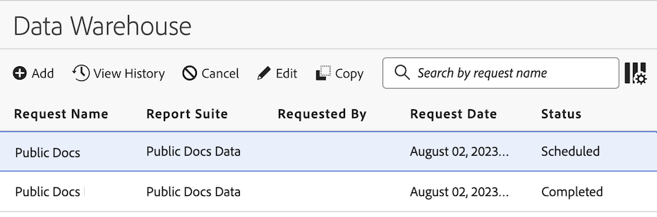

# Requisiti di sicurezza per server FTP e SFTP

Questa pagina descrive i requisiti di sicurezza per i server FTP e SFTP esistenti che ricevono dati dai feed di dati di Adobe Analytics o Data Warehouse.

* **Server FTP esistenti**: devono essere aggiornati per utilizzare SFTP, come descritto nella sezione seguente, [Aggiornare i server FTP per l’utilizzo di SFTP](#upgrade-ftp-servers-to-use-sftp).

  L’aggiornamento da FTP a SFTP è un requisito perché SFTP consente una maggiore sicurezza.

  In alternativa, per un livello di sicurezza più elevato, puoi passare a una destinazione cloud moderna. Per ulteriori informazioni, consulta [Configurare account di importazione ed esportazione cloud](https://experienceleague.adobe.com/it/docs/analytics/components/locations/configure-import-accounts).

* **Server SFTP esistenti (e server SFTP appena aggiornati)**: è necessario aggiornare le vecchie password, come descritto nella sezione seguente, [Aggiornare la password SFTP](#rotate-your-sftp-password).

  L’aggiornamento regolare della password SFTP è una best practice di sicurezza per la protezione dei dati.

>[!IMPORTANT]
>
>Considera le seguenti situazioni prima di completare i passaggi descritti in questo articolo.
>
>* **Adobe consiglia, ove possibile, di passare a una destinazione cloud moderna anziché effettuare l’aggiornamento a SFTP.**
>FTP e SFTP sono tipi di destinazione precedenti. Anziché aggiornare gli account FTP a SFTP ed aggiornare le password SFTP come descritto in questo articolo, Adobe consiglia di passare a un tipo di destinazione cloud moderna (come Amazon S3, Google Cloud Platform o Azure). Queste destinazioni cloud forniscono un livello di sicurezza più elevato. Per ulteriori informazioni, consulta [Configurare account di importazione ed esportazione cloud](https://experienceleague.adobe.com/it/docs/analytics/components/locations/configure-import-accounts).
>
>* **Se gli account FTP e SFTP sono utilizzati esclusivamente per le classificazioni, effettua la migrazione ai set di classificazione.**
>Se il tuo account FTP o SFTP è utilizzato esclusivamente per le classificazioni, dovresti eseguire la migrazione da **Importazione classificazioni** a **Set di classificazione**, anziché aggiornare gli account FTP a SFTP e le password SFTP come descritto in questo articolo. L’importazione di classificazioni diventerà obsoleta e non sarà più accessibile dopo il **31 agosto 2026**. Per ulteriori informazioni, consulta [Panoramica sui set di classificazione](https://experienceleague.adobe.com/it/docs/analytics/components/classifications/sets/overview).

## Prerequisiti

### Inventario degli account FTP

È necessario completare i passaggi di aggiornamento SFTP su questa pagina per ogni sito FTP utilizzato con feed di dati o Data Warehouse.

Di conseguenza, dovrai identificare tutti gli account FTP che ricevono dati per feed di dati o Data Warehouse. Queste informazioni sono visualizzate nelle impostazioni di configurazione FTP, come descritto nella sezione [Tipi di account legacy](/help/components/locations/configure-import-accounts.md#configure-a-location-account) dell’articolo [Configurare gli account di importazione ed esportazione cloud](/help/components/locations/configure-import-accounts.md).

Per ogni account, raccogli le seguenti informazioni:

* **Host**: il nome host del server FTP a cui il tuo account si connette (ad esempio, `ftp.omniture.com`, `ftp2.omniture.com` e così via).

* **Porta**: durante l’utilizzo di un server SFTP ospitato da Adobe, i client SFTP si connettono alla porta 22. Le connessioni FTP non sicure utilizzano la porta 21.

* **Nome utente**: il nome utente utilizzato per accedere al server FTP.

* **Segreto dell’account posizione**: il segreto account corrente per l’account. È il segreto account (password) che utilizzi attualmente durante il download dei dati forniti alla posizione FTP. Queste informazioni non sono disponibili dall’interfaccia di Adobe Analytics.

### Confermare di potere aggiornare le credenziali negli strumenti

Assicurati di poter aggiornare le password SFTP in qualsiasi strumento o script che utilizzi per connetterti al sito SFTP (ad esempio, un client SFTP, uno script automatizzato o una piattaforma di terze parti).

Tutti i client devono connettersi tramite SFTP utilizzando una password come fallback.

## Aggiornare i server FTP per utilizzare SFTP

>[!IMPORTANT]
>
>Se i dati FTP vengono forniti a un partner di terze parti (ad esempio, una società di consulenza o un fornitore di analisi), coordinati con loro prima di seguire i passaggi descritti in questo articolo.

### Passaggio 1: generare le chiavi SSH dell’organizzazione per il download dei dati

In questa sezione viene descritto come generare le chiavi SSH dell’organizzazione (una coppia di chiavi pubblica/privata) utilizzate per **scaricare dati** dal server SFTP.

>[!NOTE]
>
>In un passaggio futuro, dovrai scaricare un’altra chiave pubblica fornita da Adobe. Questa è parte di una seconda coppia di chiavi pubblica/privata, utilizzata da Adobe per **caricare dati** sul server SFTP.

Per configurare un trasferimento sicuro per il download dei dati dal server FTP:

1. Accedi alla workstation in cui scarichi i dati dal server FTP.

1. Genera una coppia di chiavi pubblica/privata da utilizzare per il trasferimento sicuro.

   Durante l’utilizzo di un server SFTP ospitato da Adobe, Adobe supporta le chiavi RSA e ed25519.

   * **In un ambiente Linux**: esegui il comando seguente per generare la coppia di chiavi ed25519:

     ```
     ssh-keygen -t ed25519 -C "your-comment-or-email"
     ```

     Se i criteri non consentono di utilizzare le chiavi ed25519, esegui il comando seguente per generare la coppia di chiavi RSA:

     ```
     ssh-keygen -t rsa -b 4096 -C "your-comment-or-email"
     ```

   * **In un ambiente Windows**: utilizza PuTTYgen.

1. Crea un file denominato [!DNL `authorized_keys`] (senza estensione).

1. Copia il contenuto della chiave pubblica nel file [!DNL `authorized_keys`].

1. In un passaggio futuro, sarà necessario ritornare a questo file [!DNL `authorized_keys`] per aggiungere la chiave pubblica di Adobe, utilizzata da Adobe per caricare i dati sul server SFTP. Quindi potrai aggiungere il file [!DNL `authorized_keys`] al server SFTP.

### Passaggio 2: creare un nuovo account di posizione SFTP in Adobe Analytics

Crea un nuovo account di posizione SFTP per sostituire ogni account FTP esistente.

Durante la creazione di un nuovo account di posizione SFTP, devi utilizzare lo stesso nome host e lo stesso nome utente usati nell’account FTP esistente che sta sostituendo.

>[!NOTE]
>
>In un passaggio futuro, dovrai configurare questo nuovo account posizione da utilizzare come destinazione per le forniture di feed di dati e Data Warehouse.

#### Creare l’account SFTP

1. In Adobe Analytics, passa a [!UICONTROL **Componenti**] > [!UICONTROL **Posizioni**].

1. Seleziona la scheda [!UICONTROL **Account posizione**].

1. Seleziona [!UICONTROL **Aggiungi account**].

1. Nel menu a discesa [!UICONTROL **Tipo di account**], seleziona [!UICONTROL **SFTP (legacy)**].

1. Completa i campi seguenti:

   | Nome campo: | Funzione |
   |---------|----------|
   | [!UICONTROL **Nome host**] | Il nome host SFTP (ad esempio, `ftp.omniture.com`). |
   | [!UICONTROL **Porta**] | Porta del firewall attraverso la quale verranno inviati i dati. Per le connessioni SFTP ospitate da Adobe è la Porta 22. |
   | [!UICONTROL **Nome utente**] | Il tuo nome utente SFTP. Utilizza lo stesso nome utente che usi per il tuo account FTP. |

1. Seleziona [!UICONTROL **Salva**].

1. Nella finestra di dialogo [!UICONTROL **Account creato**], scarica la chiave pubblica RSA o ed25519, quindi seleziona [!UICONTROL **OK**]. Questa è la chiave pubblica SSH utilizzata da Adobe per caricare dati sul server SFTP. (Utilizzerai questa chiave nella sezione seguente, [Aggiungere la chiave pubblica SSH di Adobe al server SFTP](#add-adobes-ssh-public-key-to-the-sftp-server)).

1. Ripeti questo processo per ogni account SFTP che desideri creare.

1. Continua con la sezione seguente, [Caricare la chiave pubblica sul server SFTP](#upload-the-public-key-to-the-sftp-server).

#### Aggiungere la chiave pubblica SSH di Adobe al file [!DNL `authorized_keys`] e caricarla sul proprio server FTP

La chiave pubblica appena scaricata nel passaggio 7 della sezione precedente fa parte di una coppia di chiavi pubblica/privata utilizzata da Adobe per **caricare dati** sul server SFTP.

Dovrai aggiungere questa chiave pubblica allo stesso file [!DNL `authorized_keys`] in cui hai precedentemente aggiunto la chiave di download dell’organizzazione (quella generata in [Passaggio 1: generare le chiavi SSH dell’organizzazione per il download dei dati](#step-1-generate-your-organizations-ssh-keys-for-downloading-data)).

Per aggiungere la chiave pubblica SSH di Adobe al file [!DNL `authorized_keys`] e caricarlo sul server FTP:

1. Accedi alla workstation in cui scarichi i dati dal server FTP.

1. Apri il file [!DNL `authorized_keys`] e aggiungi la chiave di caricamento di Adobe. Questo file dovrebbe già contenere la chiave di download della tua organizzazione da [Passaggio 1: generare le chiavi SSH dell’organizzazione per il download dei dati](#step-1-generate-your-organizations-ssh-keys-for-downloading-data).

1. Carica il file [!DNL `authorized_keys`] sul server FTP:

   1. Connettiti al server FTP e accedi con il tuo nome utente e la tua password.
Può essere un server FTP ospitato da Adobe o il tuo server FTP.
   1. Crea una directory [!DNL .ssh] (se non esiste già).
   1. Carica il file [!DNL `authorized_keys`] nella directory [!DNL .ssh].

1. Aggiorna le impostazioni del firewall per consentire le connessioni in entrata dal server SFTP. Quando utilizzi un server SFTP ospitato da Adobe, consenti le connessioni in entrata dagli intervalli IP di Adobe sulla porta 22.

1. Testa la connessione accedendo al server utilizzando il client SFTP.

1. Ripeti questo processo per ogni account SFTP creato nella sezione precedente, [Creare l’account SFTP](#create-the-sftp-account).

1. Continua con la seguente sezione, [Aggiungere una posizione all’interno dell’account](#add-a-location-within-the-account).

#### Aggiungere una posizione all’interno dell’account

1. Nella scheda [!UICONTROL **Posizioni**], seleziona [!UICONTROL **Aggiungi posizione**].

1. Specifica un nome, una descrizione e se questa posizione verrà utilizzata con feed di dati o Data Warehouse.

1. Nel campo [!UICONTROL **Account posizione**], seleziona l’account appena creato.

1. Nel campo [!UICONTROL **Percorso directory**], specifica il percorso della directory sul server SFTP. Le cartelle nel percorso devono già esistere; in caso contrario, si verifica un errore. Ad esempio: `/folder_name/folder_name`.

1. Seleziona [!UICONTROL **Salva**].

1. Ripeti questo processo per ogni account SFTP creato.

Per istruzioni dettagliate, consulta [Configurare posizioni di importazione ed esportazione cloud](https://experienceleague.adobe.com/it/docs/analytics/components/locations/configure-import-locations).

### Passaggio 3: modificare richieste di Data Warehouse e feed di dati per utilizzare la nuova destinazione SFTP

Aggiorna le richieste di Data Warehouse e i feed di dati pianificati esistenti che attualmente inviano dati a destinazioni FTP per utilizzare le nuove destinazioni SFTP create.

#### Modificare i feed di dati

Modifica ogni feed di dati pianificato configurato con la vecchia destinazione FTP per utilizzare la nuova destinazione SFTP:

1. In Adobe Analytics, seleziona [!UICONTROL **Amministratore**] > [!UICONTROL **Feed dati**].

1. Individua il feed di dati che desideri modificare. Per individuare un feed di dati, puoi [filtrare e cercare nell’elenco dei feed di dati](#filter-and-search-the-list-of-data-feeds).

1. Seleziona il feed di dati nella colonna [!UICONTROL **Nome feed**].

   Viene visualizzata la pagina [!UICONTROL **Modifica _feed_name_**].

1. Nella sezione [!UICONTROL **Destinazione**], nel campo [!UICONTROL **Account**], utilizza il menu a discesa per selezionare la nuova destinazione SFTP creata.

1. Nel campo [!UICONTROL **Posizione**], utilizza il menu a discesa per selezionare la posizione nell’account SFTP.

1. Seleziona [!UICONTROL **Salva**].

Per informazioni più dettagliate, consulta [Modificare un feed dati](/help/export/analytics-data-feed/df-manage-feeds.md#edit-a-data-feed) in [Gestire i feed dati](/help/export/analytics-data-feed/df-manage-feeds.md).

#### Modificare le richieste di Data Warehouse

Modifica ogni richiesta di Data Warehouse pianificata configurata con la vecchia destinazione FTP per utilizzare la nuova destinazione SFTP:

1. In Adobe Analytics, seleziona [!UICONTROL **Strumenti**] > [!UICONTROL **Data Warehouse**].

1. Nella pagina Data Warehouse, seleziona la richiesta che desideri modificare.

   

1. Seleziona [!UICONTROL **Modifica**].

1. Seleziona la scheda [!UICONTROL **Destinazione rapporto**].

1. Nel campo [!UICONTROL **Account**], utilizza il menu a discesa per selezionare la nuova destinazione SFTP creata.

1. Nel campo [!UICONTROL **Posizione**], utilizza il menu a discesa per selezionare la posizione nell’account SFTP.

1. Seleziona [!UICONTROL **Salva modifiche**].

Per informazioni più dettagliate, consulta [Modifica richieste](/help/export/data-warehouse/data-warehouse-requests-manage.md#edit-requests) in [Gestire le richieste di Data Warehouse](/help/export/data-warehouse/data-warehouse-requests-manage.md).

### Passaggio 4: aggiornare le impostazioni del firewall

Se non lo hai già fatto, aggiorna le impostazioni del firewall come segue:

* **Durante l’utilizzo di server FTP di Adobe**: è necessario aggiornare le impostazioni del firewall per consentire le connessioni **in uscita** sulla porta 22.

* **Durante l’utilizzo del tuo server FTP**: è necessario aggiornare le impostazioni del firewall per consentire la connessione **in entrata** sulla porta che ospita il servizio, in genere la porta 22.

Inoltre, sarà necessario rimuovere le vecchie regole FTP, ad esempio quelle che consentono le connessioni in entrata sulla porta 21. (L’FTP utilizza la porta 21 e una serie di porte aggiuntive per il trasferimento dei dati. Come best practice per la sicurezza, è consigliabile rimuovere questo accesso non necessario tramite il firewall).

### Passaggio 5: verificare che le richieste pianificate di feed dati e di Data Warehouse vengano consegnate correttamente

Dopo aver aggiornato ogni richiesta esistente di feed dati e Data Warehouse per utilizzare il nuovo account e la nuova posizione SFTP, attendi la successiva consegna pianificata. Verifica che i dati arrivino alla nuova destinazione come previsto.

### Passaggio 6: aggiornare la password sul server SFTP aggiornato

Dopo aver aggiornato un server FTP a SFTP, aggiorna la password SFTP, come descritto nella sezione seguente, [Aggiornare la password SFTP](#rotate-your-sftp-password).

## Aggiornare la password SFTP

Se l’autenticazione basata su chiave non riesce, una password SFTP funge da metodo di autenticazione di fallback.

Aggiorna la password SFTP subito dopo l’aggiornamento da FTP a SFTP. Dovrebbe continuare ad aggiornarsi secondo una pianificazione regolare, in base ai criteri stabiliti.

1. Contatta l’Assistenza clienti di Adobe e richiedi una nuova password.

1. Per ogni account SFTP, fornisci **Nome host** e **Nome utente**.

   L’Assistenza clienti genererà una nuova password per ogni account FTP.

1. Aggiorna la password nel client che utilizzi per connetterti al server SFTP.


